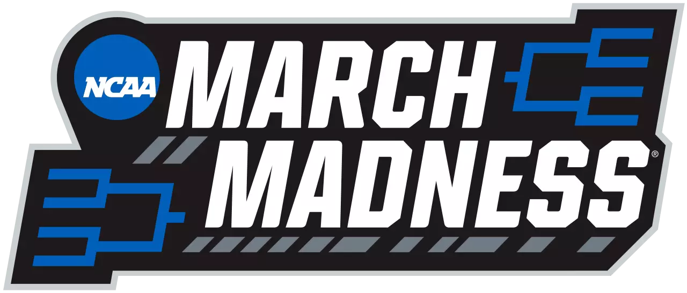

<div align="center">

# 🏀 March Madness Bracket Simulator

### Predicting bracket outcomes, sleeper teams, and upset paths with matchup-based features and Monte Carlo simulation

<br>



<br><br>


<br><br>


</div>

---

## 📌 Overview

This project is a **March Madness bracket simulator** built to explore how team strengths, matchup features, and tournament randomness interact.

Instead of trying to guess one perfect bracket, this project assigns **win probabilities** to matchups, runs **Monte Carlo simulations**, and analyzes which outcomes appear most often.

The main goal is to answer questions like:

- Which teams are most likely to win the tournament?
- Which teams make the **Final Four** most often?
- Which lower-seeded teams overperform their seed?
- Which first-round upsets show up the most?
- Can a model identify **sleeper teams** without pre-selecting them?

---

## 🎯 Project Goals

- Build a full **March Madness bracket simulator**
- Engineer matchup-based features for **all teams**
- Estimate win probabilities for each matchup
- Run Monte Carlo simulations across the full bracket
- Highlight likely champions, deep runs, upset picks, and sleeper teams

---

## 🧠 Core Idea

This project combines:

- **Feature engineering** to represent team strengths vs opponent weaknesses
- **Probability-based matchup prediction**
- **Monte Carlo simulation** to repeatedly simulate the tournament
- **Sleeper / upset analysis** to find teams that outperform expectations

Rather than hardcoding “sleeper teams,” the model is designed to let them **emerge naturally** from the simulations.

---

## 🔍 What This Project Looks At

### Bracket Results
- Championship odds
- Final Four odds
- Sweet 16 odds
- Most common bracket outcomes

### Sleeper / Upset Results
- Most dangerous lower-seeded teams
- Most likely first-round upsets
- Teams that beat their seed expectation most often
- Underdogs that make deeper runs than expected

---

## ⚙️ Planned Features

- [X] Load the official NCAA tournament bracket
- [X] Collect or import team-level season data
- [X] Create matchup-based feature differences
- [X] Estimate win probabilities for games
- [ ] Simulate the bracket thousands of times
- [ ] Analyze winners, deep runs, sleepers, and upset trends
- [ ] Add a simple Streamlit frontend for viewing results

---

## 🏗️ Possible Feature Engineering Ideas

Examples of matchup-based features this project may include:

- 3PT shooting edge
- Opponent perimeter defense weakness
- Turnover pressure vs turnover rate
- Rebounding edge
- Offensive strength vs defensive resistance
- Seed difference
- Win percentage difference
- Recent form / momentum

These features will be created for **all teams**, not just teams already viewed as sleepers.

---

## 📊 Tech Stack

- **Python**
- **Pandas**
- **NumPy**
- **scikit-learn**
- **Streamlit**
- **Matplotlib / Plotly** *(optional for visuals)*

---

## Data Source

The main data for this project comes from the Kaggle dataset **`march-machine-learning-mania-2026`**. I am using it for team information, regular season results, historical tournament results, tournament seeds, and bracket slot structure.

The main men's files used in this project include:
- `MTeams.csv`
- `MRegularSeasonCompactResults.csv`
- `MNCAATourneyCompactResults.csv`
- `MNCAATourneySeeds.csv`
- `MNCAATourneySlots.csv`

Because the live 2026 bracket needed to be worked into the project separately, I also created `bracket_2026.csv` to map the released tournament teams into the historical Kaggle data and current feature-engineering pipeline.

---

## 📁 Project Structure

```bash
march-madness-bracket-simulator/
│
├── app/                  # Streamlit frontend (optional)
├── data/                 # Raw and cleaned datasets
├── notebooks/            # Exploration and experiments
├── src/
│   └── march_madness_bracket_simulator/
│       ├── data_loader.py
│       ├── feature_engineering.py
│       ├── model.py
│       ├── simulator.py
│       ├── analysis.py
│       └── __init__.py
├── tests/                # Unit tests
├── README.md
├── pyproject.toml
├── uv.lock
└── .gitignore
```

## Environment Setup

This project currently uses `uv` for dependency management.

Create and sync the environment with:

```bash
mkdir -p .uv-cache
export UV_CACHE_DIR="$PWD/.uv-cache"
uv sync
```

Then activate the virtual environment:

```bash
source .venv/Scripts/activate
```

## 🚀 Getting Started

1. Clone the repo

```bash
git clone https://github.com/Andreachurchwell/march-madness-bracket-simulator
cd march-madness-bracket-simulator
```

2. Create and sync the environment

```bash
mkdir -p .uv-cache
export UV_CACHE_DIR="$PWD/.uv-cache"
uv sync
source .venv/Scripts/activate
```

3. Start exploring the data

Begin in `notebooks/exploration.ipynb` or add loaders in `src/march_madness_bracket_simulator/data_loader.py`.

## 💡 Why This Project?

March Madness is one of the hardest events in sports to predict because the tournament is full of:

- upsets

- randomness

- sleeper teams

- injuries

- matchup-specific chaos

**That makes it the perfect setting for a project focused on probabilities, simulation, and pattern discovery instead of trying to guess one perfect bracket.**

## Personal Motivation

March is honestly one of my favorite months of the year. It is my mom's birthday month, and March Madness is something we both love. She always seems to do better than me on the bracket, and I still do not know if that is because she has way more experience, because she does not fall for underdogs the way I do, or because she is just lucky.

That is a big part of why I wanted to make this project. I wanted to see if I could use data, feature engineering, and simulation to make smarter bracket decisions while still keeping the fun of trying to spot upsets and sleeper teams.


## 🏀 Main Question

If we simulate the NCAA tournament over and over using matchup-based team features, which teams, upsets, and sleeper runs keep showing up?

## 📌 Status

### 🚧 Current Progress

This project is now past the setup stage and into baseline modeling and prediction.

Completed so far:
- project setup and package structure
- men's NCAA data loading
- first team-season feature engineering
- 2026 bracket cleaning and team matching
- historical tournament matchup dataset construction
- baseline logistic regression model training
- 2026 first-round baseline predictions for non-play-in games
- Streamlit app shell with current project outputs

Current next steps:
- handle play-in teams
- advance winners through later bracket rounds
- run Monte Carlo tournament simulations
- summarize champions, sleeper teams, and upset paths


## 👩‍💻 Author

Andrea Churchwell

A project built to explore March Madness through simulation, matchup analysis, and sports analytics.
