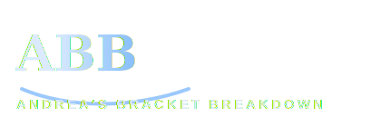

<div align="center">

# Andrea's Bracket Breakdown

### March Madness bracket prediction, simulation, and upset analysis

<br>



<br><br>


</div>

---

## Overview

Andrea's Bracket Breakdown is a men's March Madness project built to compare two ways of reading the tournament:

- a **deterministic bracket** that always advances the higher-probability team
- a **Monte Carlo simulation view** that runs the full tournament many times and measures which outcomes happen most often

The goal is not just to pick one bracket. It is to understand:

- who is most likely to win the title
- which teams reach later rounds most often
- which lower-seeded teams overperform expectations
- where the best upset opportunities appear

---

## Data

Main source:

- Kaggle `march-machine-learning-mania-2026`

Men's files used:

- `MTeams.csv`
- `MRegularSeasonCompactResults.csv`
- `MNCAATourneyCompactResults.csv`
- `MNCAATourneySeeds.csv`
- `MNCAATourneySlots.csv`

Project-specific bracket file:

- `data/raw/bracket_2026.csv`

---

## Model

The baseline model is a logistic regression trained on historical NCAA tournament matchups.

Current matchup-difference features:

- `win_pct_diff`
- `points_for_diff`
- `points_against_diff`
- `scoring_margin_diff`

Held-out baseline performance:

- Accuracy: about `0.69`
- Log loss: about `0.58`

---

## Current Results

### Deterministic Bracket

- East champion: `Duke`
- West champion: `Gonzaga`
- South champion: `Florida`
- Midwest champion: `Michigan`
- National champion: `Michigan`

### Monte Carlo Title Odds

From `1000` full tournament simulations:

- `Duke`: about `17.5%`
- `Gonzaga`: about `14.0%`
- `Michigan`: about `13.7%`
- `Arizona`: about `10.1%`
- `Iowa St.`: about `6.8%`
- `Saint Louis`: about `6.2%`

One of the main project takeaways is that the deterministic bracket picked `Michigan`, while the most common simulated champion was `Duke`.

---

## App

The Streamlit app currently shows:

- a deterministic bracket view
- a consensus simulation Final Four view
- championship odds
- round-1 upset watch
- one random tournament run

Branding:

- **Andrea's Bracket Breakdown**

---

## Project Structure

```text
march-madness-bracket-simulator/
|- app/
|- assets/
|- data/
|- notebooks/
|- src/
|  \- march_madness_bracket_simulator/
|     |- analysis.py
|     |- data_loader.py
|     |- feature_engineering.py
|     |- model.py
|     |- simulator.py
|     \- __init__.py
|- tests/
|- README.md
|- projectnotes.md
|- andrea.md
|- pyproject.toml
\- uv.lock
```

---

## Setup

Sync the environment:

```bash
uv sync
```

Activate it:

```bash
source .venv/Scripts/activate
```

Run tests:

```bash
./.venv/Scripts/python.exe -m pytest tests/test_simulator.py
```

Run the app:

```bash
streamlit run app/streamlit_app.py
```

---

## Next Steps

- add Final Four odds and regional win odds
- define sleeper teams more explicitly from simulation results
- keep refining the app layout and bracket presentation
- record a project walkthrough video

---

## Author

Andrea Churchwell
