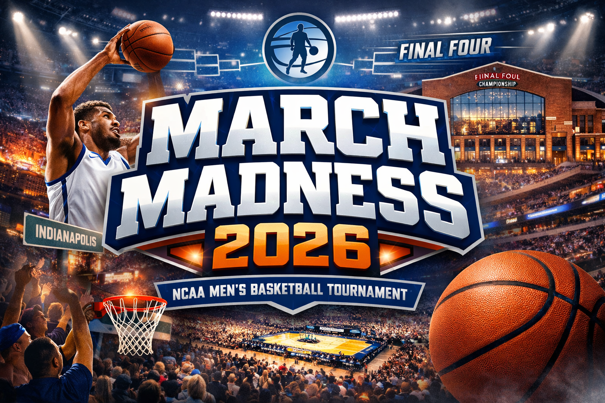
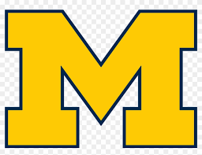
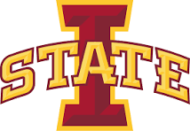
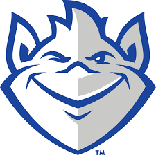

<div align="center">

# Andrea's Bracket Breakdown

### March Madness bracket prediction, simulation, and upset analysis

<br>



<br><br>


</div>

---

## 🏀 Overview

Andrea's Bracket Breakdown is a men's March Madness project built to compare two ways of reading the tournament:

- a **deterministic bracket** that always advances the higher-probability team
- a **Monte Carlo simulation view** that runs the full tournament many times and measures which outcomes happen most often

The goal is not just to pick one bracket. It is to understand:

- who is most likely to win the title
- which teams reach later rounds most often
- which lower-seeded teams overperform expectations
- where the best upset opportunities appear

---

## 📂 Data

Main source:

- Kaggle `march-machine-learning-mania-2026`

Men's files used:

- `MTeams.csv`
- `MRegularSeasonCompactResults.csv`
- `MNCAATourneyCompactResults.csv`
- `MNCAATourneySeeds.csv`
- `MNCAATourneySlots.csv`

Project-specific bracket file:

- `data/raw/bracket_2026.csv`

---

## 🧠 Model

The baseline model is a logistic regression trained on historical NCAA tournament matchups.

Current matchup-difference features:

- `win_pct_diff`
- `points_for_diff`
- `points_against_diff`
- `scoring_margin_diff`

Held-out baseline performance:

- Accuracy: about `0.69`
- Log loss: about `0.58`

---

## 📊 Current Results

### Deterministic Bracket

<p>
  
  
  
  
</p>

| Region | Champion |
|---|---|
| East | `Duke` |
| West | `Gonzaga` |
| South | `Florida` |
| Midwest | `Michigan` |
| National Champion | `Michigan` |

### Monte Carlo Title Odds

From `1000` full tournament simulations:

<p>
  
  
  
  
  
  
</p>

| Team | Championship Odds |
|---|---|
| `Duke` | about `18.5%` |
| `Gonzaga` | about `13.9%` |
| `Michigan` | about `13.9%` |
| `Arizona` | about `8.5%` |
| `Iowa St.` | about `6.7%` |
| `Saint Louis` | about `6.0%` |

One of the main project takeaways is that the deterministic bracket picked `Michigan`, while the most common simulated champion was `Duke`.

---

## ✨ App

The Streamlit app currently shows:

- a deterministic bracket view
- a consensus simulation Final Four view
- championship odds
- Final Four odds
- regional win odds
- round-1 upset watch
- one random tournament run

Branding:

- **Andrea's Bracket Breakdown**

---

## 🎯 Main Question

If I simulate the NCAA tournament over and over using matchup-based team features, which teams, upsets, and sleeper runs keep showing up?

---

## 🗂️ Project Structure

```text
march-madness-bracket-simulator/
|- app/
|- assets/
|- data/
|- notebooks/
|- src/
|  \- march_madness_bracket_simulator/
|     |- analysis.py
|     |- data_loader.py
|     |- feature_engineering.py
|     |- model.py
|     |- simulator.py
|     \- __init__.py
|- tests/
|- README.md
|- projectnotes.md
|- andrea.md
|- pyproject.toml
\- uv.lock
```

---

## 🚀 Setup

Sync the environment:

```bash
uv sync
```

Activate it:

```bash
source .venv/Scripts/activate
```

Run tests:

```bash
./.venv/Scripts/python.exe -m pytest tests/test_simulator.py
```

Run the app:

```bash
streamlit run app/streamlit_app.py
```

---

## 💖 Why This Project

March Madness is one of the most fun and chaotic things to try to predict because one bracket can look completely different from another just from a few close games flipping.

This project was a way to combine:

- sports
- data
- simulation
- sleeper-team hunting

into something that is both analytical and fun to explore.

## Personal Motivation

March is honestly one of my favorite months of the year. It is my mom's birthday month, and March Madness is something we both love. She always seems to do better than me on the bracket, and I still do not know if that is because she has way more experience, because she does not fall for underdogs the way I do, or because she is just lucky.

That is a big part of why I wanted to make this project. I wanted to see if I could use data, feature engineering, and simulation to make smarter bracket decisions while still keeping the fun of trying to spot upsets and sleeper teams.

---

## 🌟 Next Steps

- add Final Four odds and regional win odds
- define sleeper teams more explicitly from simulation results
- keep refining the app layout and bracket presentation
- record a project walkthrough video

---

## 👩‍💻 Author

Andrea Churchwell
